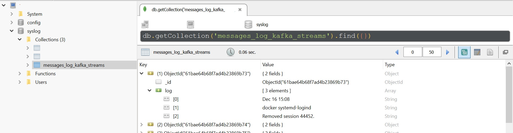

# Syslog realtime interpret by kafka streams

## What is it ?

This project uses kafka streams to realtime interpret syslog, and insert to mongoDB. Syslog include message file.

## How to use ?

## 1. Run zookeeper, kafka server, connect, mongoDB, and create topic:

### Monolithic:

$ `bash start-zookeeper-kafka-connect-mongodb.sh`

### Container:

$ ``

## 2. Run kafka streams:

$ `mvn exec:java -Dexec.mainClass=myapps.LineSplit`

## 3. create local file source connector and mongodb sink connector:

$ `bash ./connect-distributed-connector-bin/create-local-file-source-connector.sh`

$ `bash ./connect-dirtributed-connector-bin/create-mongodb-sink-connector.sh`

### Login mongoDB checkout:

Address: localhost
Port: 27017

